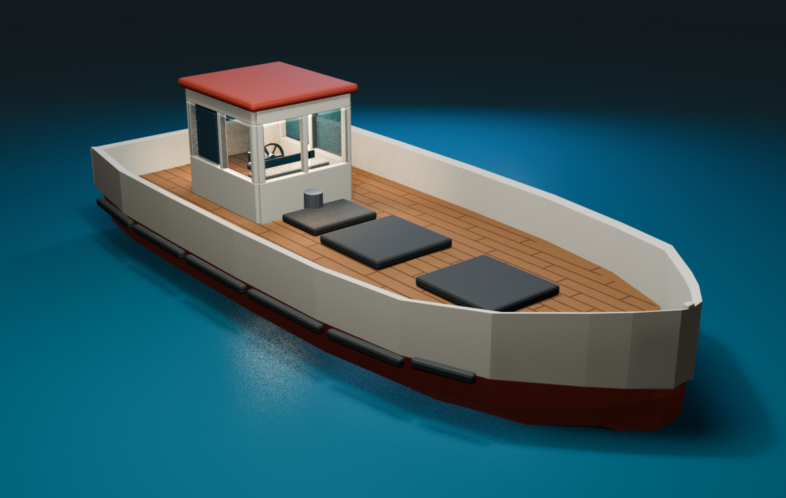
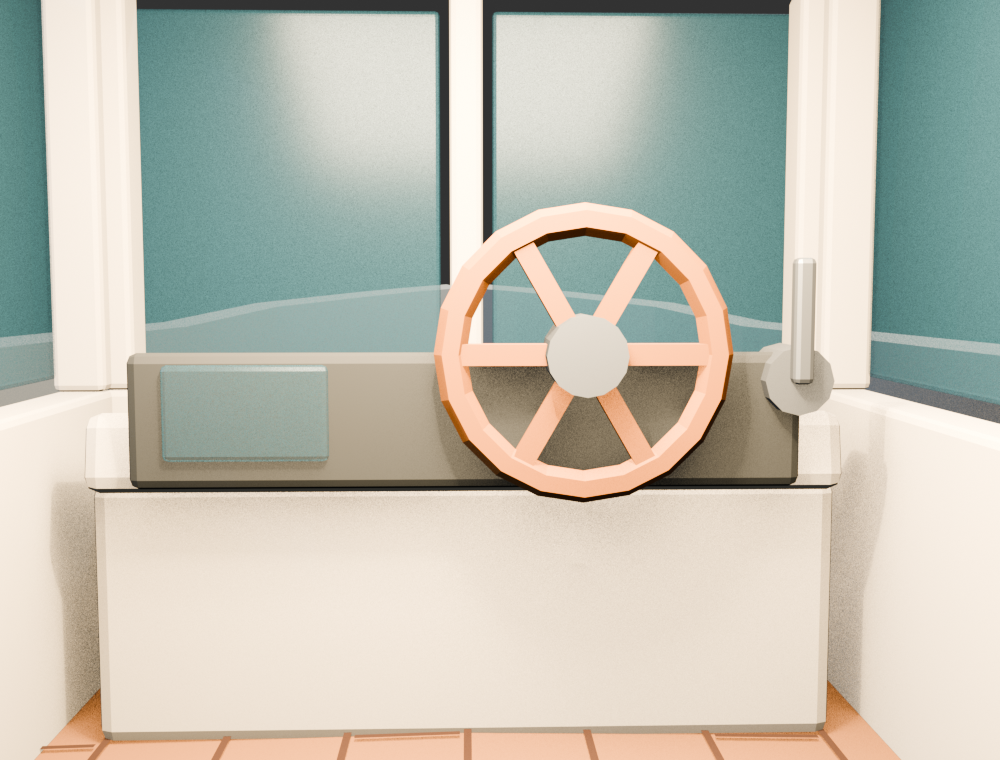

# Casco modular del pesquero — investigación y contrato del prototipo

## Resultado

El primer prototipo es un **pesquero de trabajo low-poly de desplazamiento**:
13 m de eslora, 5,4 m de manga máxima en cubierta, fondo en V suave/doble
pantoque, proa afinada y elevada, y popa espejo. No intenta ser un plano naval
certificable; es un chasis jugable diseñado alrededor de los contratos que el
proyecto ya tenía.

La segunda iteración convierte la caseta en una **cabina transitable y ocupable**:
entrada abierta, puesto de mando, timón físico, sonar, telégrafo y piso de madera
continuo. Ya no es una caja decorativa ni una colisión maciza.

La decisión importante no es solo la forma. El barco queda dividido en dos
capas con responsabilidades distintas:

- **Godot conserva la verdad jugable:** `RigidBody3D`, colisiones simples, masa,
  centro de masa, ocho sondas de flotación y sockets de mejoras.
- **Blender conserva la verdad visual:** casco, cubierta de madera, bordas,
  marcos de cabina, ventanas, puesto de mando, escotillas, defensas y materiales;
  Godot consume un GLB exportado.

Así una mejora visual no cambia la física en silencio y una reexportación no
borra los anclajes funcionales.

## Qué había realmente en el checkout

`game/boat/fishing_boat.tscn` era un greybox de `BoxMesh`:

| Contrato existente | Valor |
|---|---:|
| Eslora | 12,0 m |
| Manga | 4,5 m |
| Casco-caja | 1,6 m de alto |
| Cubierta | Y local 0,80 m |
| Masa | 4.000 kg |
| Centro de masa | Y local -0,45 m |
| Sondas | 8 × 1,5 m³ |
| Sondas de proa | X ±0,18 / Z -4,0 m |
| Otras tres filas | X ±1,5 / Z -1,5 / 1,5 / 4,5 m |
| Proa | -Z de Godot |

Las sondas pueden desplazar 12 m³. Para equilibrar 4 t en agua plana necesitan
aproximadamente un tercio de inmersión; la línea de agua teórica queda cerca de
Y local -0,23 m. Esta cifra es un control de coherencia del código actual, no un
cálculo hidrostático certificado.

La malla nueva conserva eslora, alturas, masa, centro de gravedad y volumen
total de sondas porque el barco ya soporta (la manga sí creció después, a 5,0 m;
ver «Ensanche» más abajo):

- caminar y pescar en primera persona;
- barriles rigidbody sobre cubierta;
- tests de asentamiento y estabilidad;
- MURO, COLOSO y LEVIATÁN;
- ocho celdas que después se convertirán en inundación por compartimentos.

## Referencia naval y adaptación al juego

La referencia dimensional más próxima encontrada es el arrastrero FAO IND-101:
12,8 m de eslora, 4,28 m de manga, 1,99 m de puntal y cinco compartimentos. Su
disposición reserva una cubierta de trabajo clara y separa cabina, máquinas y
bodega, exactamente los verbos que necesita Proyecto Agua. Ver el
[plano y especificación del arrastrero FAO](https://www.fao.org/4/V9468E/v9468e0e.htm).

Otra configuración FAO de 12,8 m distribuye cabina, motor, bodega, stores y
aparejos como módulos longitudinales, lo que respalda no soldar todo en una sola
malla. Ver la [configuración de palangrero pequeño, figura 11](https://www.fao.org/fishery/docs/CDrom/bobp/cd1/Bobp/Publns/MIS/0007.pdf).

La manga del juego es deliberadamente generosa: `L/B = 2,41`. Un casco real
eficiente tendería a ser más esbelto, pero reducirlo ahora haría más angostos los
pasos para 2–6 personas. La solución del prototipo es conservar manga de
cubierta, afinar el volumen bajo la línea de agua mediante flare moderado y
acercar únicamente las dos sondas de proa a crujía.

### Cómo creció el casco: 12,0 × 4,5 → 12,0 × 5,0 → 13,0 × 5,4 m

Dos pasadas de playtest, la primera «ensanchar un poco» y la segunda «un poco más,
de ancho y de largo». Ninguna de las dos redibuja el casco: **escalan**. La Y de
cada cuaderna se multiplica por `LENGTH/12,0` y su semimanga por `BEAM/4,5`, así
que flare, chines y entrada de proa son los del primer día, sólo más grandes.

Dos cosas nunca escalan, y por motivos distintos:

- **La roda.** Es un filo y tiene que seguir siéndolo. Al crecer el resto, la
  entrada de proa queda un punto más llena — que es exactamente lo que se quería.
- **Las alturas.** Quilla, sheer y cubierta (Y local 0,80) se quedan donde están:
  el jugador mide siempre lo mismo, y toda la cabina, los sockets y las capturas
  siguen valiendo.

Lo que **tampoco** cambió, a propósito: masa (4.000 kg), centro de masa y **las
ocho sondas, todavía en X ±1,5 / ±0,18 y Z −4,0 / ±1,5 / +4,5**. Como la
flotabilidad la producen las sondas y no la malla, dejarlas quietas conserva el
calado exacto: medido antes y después con mar de furia 7, el calado pasó de 0,2547
a 0,2570 m (2 mm) y el balanceo RMS de 6,76° a 6,95°. El casco creció; la física
que se jugó y se ajustó, no. Separar las sondas habría endurecido la escora sin
que ningún test lo dijera.

La cabina tampoco crece: está dimensionada contra la cápsula del jugador (Ø 0,70 ×
1,80 m), que no escala con el barco. Los 100 cm de eslora nuevos van íntegros a la
**cubierta de trabajo**, repartidos entre proa y popa, que es para lo que se pidió
un barco más grande.

En Godot acompañan al casco: la caja central (5,40 × 9,75 m, que ahora llega a la
borda de popa), la envolvente convexa de proa, las bordas rectas (X ±2,58, 9,10 m
de largo), las de proa (largo, centro y ángulo recalculados hasta la roda, que no
se movió), el tope de la roda, la borda de popa (4,74 m), los sockets `GearPort` /
`GearStarboard` —clavados en la borda, X ±2,37— y las luces de navegación, que
viven en las puntas. El pasillo lateral pasa de 0,89 a **1,34 m** y la franja de
popa de 1,06 a **1,55 m**.

Ninguno de esos números se escribe dos veces: se derivan de la misma malla que
genera Blender, y `boat_asset_tests.gd` los ata entre sí en vez de a una medida
fija — la borda de COLISIÓN contra la borda VISIBLE, la caja central contra la
envolvente de proa, el socket de aparejo contra la borda. Si una futura manga
cambia en el generador y alguien olvida una pieza, el jugador chocaría con aire o
caería a través del arte, y ningún otro check lo delataría.

### Forma elegida

- **Proa fina y elevada:** lee mejor contra una ola y deja de ser una caja.
- **V suave/doble pantoque:** planos claros para low-poly, mejor lectura de
  volumen y una base estable para futuras variantes.
- **Centro lleno:** mantiene dentro de la silueta las seis sondas X ±1,5.
- **Popa espejo:** superficie modular para motor, timón, escala y equipos.
- **Francobordo cercano a 1 m en reposo:** coincide con la física inferida y
  deja espacio para que el agua sobre borda sea una señal de peligro.

### Cabina transitable y puesto permanente

El volumen anterior era un prisma cerrado de 2,60 × 2,90 × 2,00 m. Aunque se
dibujaba una puerta encima, no existía ni hueco visual ni paso físico. Además,
los costados dejaban apenas 0,71 m: prácticamente el mismo diámetro que la
cápsula del jugador.

La caseta nueva se resolvió como cuatro marcos con espesor, no como una cáscara
opaca. Sus medidas de gameplay son:

| Contrato de cabina | Valor |
|---|---:|
| Exterior | 2,10 m de ancho × 2,35 m de largo |
| Piso | Y local 0,80–0,82 m |
| Cara inferior del techo | Y local 2,98 m |
| Altura libre | 2,18 m |
| Puerta trasera centrada | 1,00 × 2,00 m |
| Paso lateral mínimo | 1,34 m |
| Giro detrás de la cabina | 1,55 m |
| Cápsula real del jugador | Ø 0,70 × 1,80 m |

La puerta corrediza aparece recogida contra estribor y todavía no tiene
colisión ni animación: en esta fase prima que la ruta nunca quede bloqueada. El
suelo no duplica colisión; usa la cara superior del casco, exactamente a Y 0,80.

Para un puesto donde habrá alguien de forma continua, el timón quedó ligeramente
a estribor, el sonar a babor y el telégrafo al alcance de la mano. El aro del
timón mide 0,64 m y su origen está en el eje para poder animarlo después. Los
parabrisas y cuatro ventanas laterales ocupan huecos reales y dejan visión hacia
proa. Es una adaptación de gameplay, no una certificación naval, pero sigue el
principio de minimizar obstrucciones desde el puesto principal que explican la
[guía MCA sobre visibilidad en cabinas de pesqueros](https://www.gov.uk/government/publications/mgn-314-wheelhouse-visibility-onboard-fishing-vessels)
y el [código vigente para pesqueros menores de 15 m](https://www.gov.uk/government/publications/the-code-of-practice-for-the-safety-of-small-fishing-vessels-of-less-than-15m-length-overall/the-code-of-practice-for-the-safety-of-small-fishing-vessels-of-less-than-15m-length-overall).

### Cubierta de madera

`WorkingDeck` sigue siendo la superficie continua y liviana, pero ahora usa
`M_DeckWood_Oak`. Encima, `DeckPlankSeams` dibuja juntas longitudinales cada
28 cm y empalmes alternados. Es una sola malla editable, no un nodo por tabla;
continúa debajo de la caseta y por eso el interior también tiene piso de madera.
Más adelante se puede sustituir por UV y textura PBR sin cambiar nombres,
colisiones ni sockets.

Las normas reales para pesqueros pequeños insisten en cubierta estanca,
mamparos, coamings y desagüe rápido del agua atrapada. No se aplican aquí como
certificación, pero son buenos principios visuales y de gameplay: las futuras
escotillas deben cerrar, las celdas deben estar separadas y los imbornales deben
verse. Referencias: [FAO/ILO/IMO para pesqueros de menos de 12 m](https://www.fao.org/4/i3108e/i3108e.pdf) y [código MCA para pesqueros de menos de 15 m](https://www.gov.uk/government/publications/the-code-of-practice-for-the-safety-of-small-fishing-vessels-of-less-than-15m-length-overall/the-code-of-practice-for-the-safety-of-small-fishing-vessels-of-less-than-15m-length-overall).

## Arquitectura de mallas

El GLB no es una sola pieza. Contiene objetos reemplazables:

- `HullShell`: media malla con Mirror y dos superficies, pintura y antifouling.
- `Transom`: espejo de popa reemplazable, partido por la línea de agua.
- `WorkingDeck` y `DeckPlankSeams`: base de madera y juntas editables, con
  camber leve.
- `BulwarkPort`, `BulwarkStarboard`, `BulwarkStern`, `BulwarkBow`.
- cuatro marcos `Wheelhouse*Frame`, `WheelhouseRoof`, puerta abierta y seis
  ventanas en huecos reales;
- `HelmConsole`, `InstrumentPanel`, `SonarDisplay`, `HelmWheel`, `HelmHub` y
  telégrafo de motor.
- `HatchHoldForward`, `HatchHoldAft`, `HatchEngine`.
- defensas laterales por tramos y `MastFoot`.

El blockout tiene 43 objetos mesh. La geometría base generada suma 1.626
vértices y 1.687 triángulos antes de evaluar Mirror y bevels; sigue siendo lo
bastante liviana para iterar sin decidir todavía un presupuesto final de LOD.

### Sockets nativos de Godot

`fishing_boat.tscn/UpgradeSockets` incorpora marcadores para:

- timón y sonar;
- bomba de babor y segunda bomba de estribor;
- aparejos a ambas bordas y chigre central;
- dos bodegas;
- motor;
- luces de proa/popa;
- mástil/cofa.

Sobre esos anclajes cuelgan ya cuatro módulos reales: los dos soportes de caña
(`GearPort` / `GearStarboard`), la bodega medieval (`HoldAft`, rotada 180° para
leer el pizarrón desde proa) y la **bomba manual de achique** (`PumpPort`, ver
`docs/BOMBA_MANUAL.md`). Cada uno entra por su propia escena, nunca copiado dentro
del `.tscn` del barco: así la mejora que lo sustituya sólo tiene que cambiar la
instancia.

Estos `Marker3D` son hijos del barco, pero no del GLB. Por eso se pueden mover en
Godot y sobreviven a la reimportación. La convención es que el eje local `-Z`
apunte hacia el frente funcional del módulo: los aparejos miran fuera de cada
borda, las bombas hacia el pasillo y el sonar hacia el puesto del jugador. Cada
socket describe además la huella aproximada que debe mantenerse libre.

## Por qué la colisión no sigue la malla

La malla renderizada es cóncava y el barco es un cuerpo dinámico. Godot reserva
las colisiones cóncavas/trimesh para cuerpos estáticos; en un `RigidBody3D`
convienen primitivas o pocas formas convexas. El prototipo usa una caja central
de 9,75 m, una convexa afinada para la proa, bordas segmentadas, ocho cajas para
marcos, techo y consola de la cabina, y una más para el cuerpo de la bomba manual
(`PumpPortShape`): diecisiete `CollisionShape3D` nativos en total. Esa última es
el patrón para todo el mobiliario de cubierta que deba frenar al jugador: el
módulo aporta el arte y su `Area3D`, y lo sólido vive aquí, porque el GLB no
importa física. Ver la
[guía oficial de CollisionShape3D](https://docs.godotengine.org/en/4.7/tutorials/physics/collision_shapes_3d.html).

Esto elimina tanto la pared invisible que formaba la antigua caja de 4,5 m en la
roda como el bloque macizo de la caseta, sin convertir el arte en una colisión
dinámica cóncava. Godot recomienda primitivas para cuerpos dinámicos porque son
más confiables que un trimesh; las formas cóncavas no funcionan en un
`RigidBody3D` dinámico.

La prueba `boat_asset_tests.tscn` no se limita a comparar medidas: crea un
`CharacterBody3D` con la `CapsuleShape3D` real del jugador, recorre el pasillo de
estribor, gira por popa, entra hasta el timón y vuelve a salir. La iteración actual
pasó 95/95 comprobaciones, además de F1 10/10 y tsunami 32/32. El mismo arnés
pasa 107/107 tras las dos pasadas de crecimiento y el montaje de la bomba.

## Flujo editable Blender → Godot

Fuente:

`source_assets/boat/modular_fishing_boat.blend`

Runtime:

`game/boat/models/modular_fishing_boat.glb`

Generador reproducible:

`tools/build_modular_boat.py`

Godot recomienda glTF 2.0 para escenas 3D y explica que las modificaciones de
vértices deben volver a la fuente DCC: el motor no puede guardar encima del
archivo original importado. Las escenas heredadas o wrappers sirven para nodos
y lógica adicional. Ver [importación de escenas 3D](https://docs.godotengine.org/en/stable/tutorials/assets_pipeline/importing_3d_scenes/index.html) y [configuración/herencia de importación](https://docs.godotengine.org/en/stable/tutorials/assets_pipeline/importing_3d_scenes/import_configuration.html).

En términos prácticos:

1. Abrir el `.blend` y editar objetos de la colección `EXPORT`; `HullShell` es
   media malla con un modificador Mirror no destructivo.
2. Mantener proa `+Y` en Blender, origen al centro y cubierta en Z ≈ 0,80.
3. Mantener por separado cualquier pieza que una mejora deba ocultar o cambiar.
4. Si se cambia el vano, actualizar también los `Cabin*Shape` nativos y volver
   a ejecutar la ruta física; no generar colisión desde la malla.
5. Exportar como GLB sobre `game/boat/models/modular_fishing_boat.glb`.
6. Reimportar con Godot 4.7.2.
7. Instanciar módulos de gameplay como hijos de `UpgradeSockets/*`.

Las colecciones `SOCKET_GUIDES_NOT_EXPORTED` y
`BUOYANCY_GUIDES_NOT_EXPORTED` muestran los anclajes y las ocho sondas dentro de
Blender. Son guías de edición y nunca entran al GLB.

`tools/build_modular_boat.py` **lee esas posiciones del propio
`fishing_boat.tscn`**; no las repite. El ensanche a 5,0 m enseñó por qué: los
sockets `Gear*` se movieron a la borda nueva en Godot y su empty, escrita a mano,
se quedó medio metro adentro sobre la cubierta. No rompía el juego —las guías no
se exportan— pero quien modelara una nasa contra ella la dejaría descolgada del
`Marker3D` real, y nada avisaba. Godot es el dueño de los anclajes; si el parseo
no encuentra los 13 sockets y las 8 sondas, el generador revienta en vez de
producir una fuente que miente.

Blender ofrece `Mirror` para conservar simetría no destructiva; el GLB contiene
el resultado evaluado, mientras que la pila editable queda en el `.blend`.
Referencias: [Mirror oficial](https://docs.blender.org/manual/en/5.0/modeling/modifiers/generate/mirror.html) y [exportación glTF oficial](https://docs.blender.org/manual/en/latest/addons/import_export/scene_gltf2.html).

## Qué todavía no resuelve este prototipo

- No hay interior transitable bajo cubierta.
- Las escotillas son tapas visuales, no puertas animadas.
- No hay mamparos, agua interna ni celdas `floodable` activas.
- La puerta de cabina permanece abierta; todavía no tiene interacción ni
  animación.
- El timón de cabina es visual y animable por su origen, pero todavía no conduce
  el barco.
- Falta luz interior nocturna, asiento plegable e instrumentos funcionales.
- No hay hélice, pala de timón exterior, escala, cofa ni imbornales finales.
- Masa, centro de gravedad, drag y volumen de sondas siguen iguales; solo las
  dos sondas de proa pasaron de X ±1,5 / Z -4,5 a X ±0,18 / Z -4,0 para quedar
  dentro del casco afinado. Este cambio exige el playtest físico completo.
- No hay UV pintadas ni texturas de desgaste; los materiales son PBR planos.
- No hay LOD ni presupuesto cerrado: sería prematuro antes de aprobar silueta.

## Gates antes del siguiente pase

1. Revisar perfil, planta, frente y tres cuartos.
2. Confirmar que las guías de sondas siguen dentro del volumen visual después
   de cada edición de vértices.
3. Repetir la ruta automática y caminar manualmente por ambos pasillos con la
   cápsula de 0,70 m si se modifica cabina, bordas o puerta.
4. Pescar y dejar rodar carga en calma y furia 5–7.
5. Probar MURO y LEVIATÁN sin tocar todavía la física.
6. Activar una pieza de cada familia de sockets.
7. Solo después sumar puerta interactiva, luz/asiento y dividir celdas internas.

La próxima decisión visual que sí requiere dirección del usuario es el lenguaje
del barco final: madera costera, acero industrial, pesquero patagónico, o una
interpretación más fantástica tipo DREDGE. Ninguna de esas identidades debe
hornearse en la topología base antes de aprobarla.

## Validación ejecutada sobre esta entrega

- Blender 5.1.2 generó `.blend`, `.glb` y dos previews: 43 mallas, 1.626
  vértices y 1.687 triángulos base. La fuente conserva Mirror, 13 guías de
  socket y 8 guías de flotación.
- Godot 4.7.2 reimportó el GLB y el contrato específico pasó 95/95 en su día;
  hoy, con el casco en 13,0 × 5,4 m y la bomba montada, pasa 107/107: nombres,
  AABB, madera, timón, diecisiete colisiones nativas, holguras y recorrido físico
  de entrada/salida con la cápsula real.
- Flotación F1 pasó 10/10 y tsunami 32/32, incluido LEVIATÁN.
- `tests/capture_boat_mesh.tscn` genera hoy diez tomas con Vulkan Forward+:
  cuatro exteriores, entrada de cabina, punto de vista del timonel, detalle de
  cubierta, la bomba de babor, el pizarrón de la bodega y el cubo de cebo.
- El resto de los arneses pasó en la primera corrida salvo dos checks del rig.
  Durante la validación, `game/player/pescador.glb` recibió otra modificación
  paralela; repetido aislado sobre ese estado más reciente, `rig_tests.gd` queda
  en 41/47 por jerarquía, T-pose y cadena del hombro. Ese rig no pertenece a los
  archivos modificados en esta entrega, por lo que se dejó intacto y no se usa
  su resultado cambiante como gate del barco.
