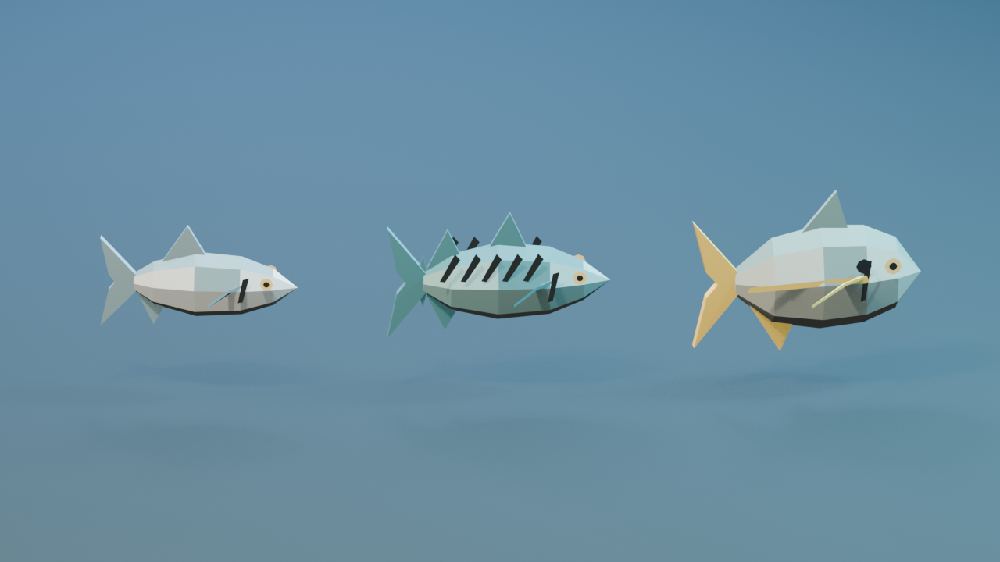
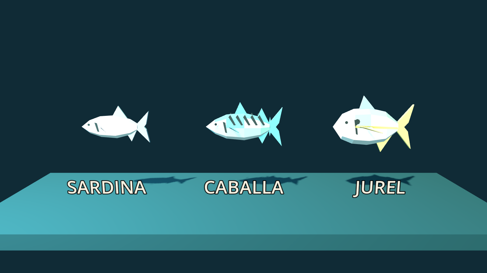

# Peces comunes — primera familia visual

## Resultado

La banda A queda formada por **Sardina, Caballa y Jurel**. Son los peces que se
capturan desde furia 0 y, por lo tanto, los que mas tiempo pasan en pantalla y
sobre cubierta. Comparten el lenguaje low-poly del barco, pero no una silueta:

- **Sardina:** la mas fina y luminosa; 180 triangulos.
- **Caballa:** compacta, con bandas dorsales grandes; 240 triangulos.
- **Jurel:** el mas alto y angular, con cola y linea doradas; 200 triangulos.

No hay texturas externas ni UV pintadas. Los bloques de color, ojos, branquias y
aletas estan integrados en una sola malla por pez. Las raices de aletas y cola se
hunden dentro del cuerpo: la superficie curva oculta la costura y evita puntas
tangenciales que parezcan flotantes. Eso mantiene el set editable, barato de
renderizar y legible incluso cuando varios rigidbodies ruedan juntos.

## Contrato con el juego

`FishSpecies` indica el `visual_scene` de cada especie comun. `Fish.setup()` monta
ese GLB bajo `VisualRoot`, pero conserva una unica escena fisica compartida:

- masa igual al peso de la especie;
- capsula simple, sin aletas que se enganchen;
- sonda de flotacion derivada del peso;
- `CapsuleMesh` anterior como fallback para peces de bandas superiores que aun
  no tienen arte propio.

Fuente editable: `source_assets/fish/common_fish.blend`  
Generador: `tools/build_common_fish.py`  
Runtime: `game/fishing/models/{sardina,caballa,jurel}.glb`

## Verificacion en Godot

Esta captura no muestra una exportacion aislada de Blender: instancia la escena
fisica compartida, ejecuta `Fish.setup()` para cada especie y renderiza los GLB
importados por Godot 4.7.2.
