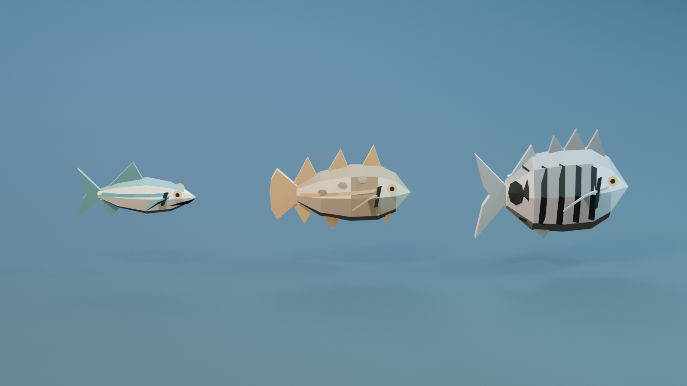
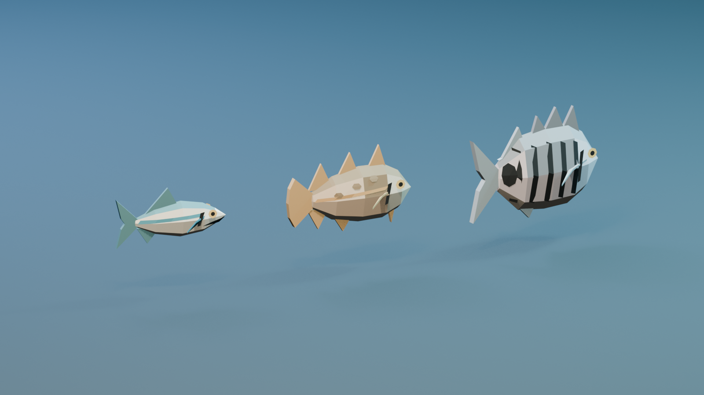
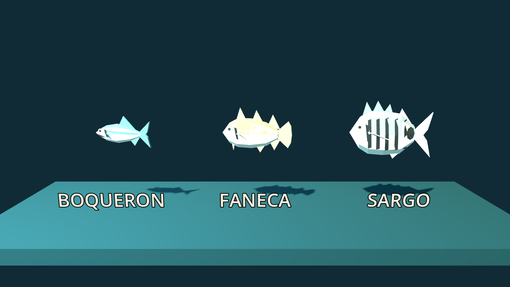

# Boquerón, Faneca y Sargo — aprobados e integrados

> Estado: **aprobados e integrados al catálogo y al runtime**.

## Perfiles

Orden de izquierda a derecha: **Boquerón · Faneca · Sargo**.

## Uniones de aletas

La vista tres cuartos abre las pectorales para poder juzgar su nacimiento. La
raíz se hunde dentro del volumen del pez; dorsales, anales y cola usan el mismo
criterio de solape y evitan puntas tangenciales visibles.

## Criterio de lectura

- **Boquerón:** el más humilde y delgado; la boca larga y la franja azul evitan
  que sea una sardina reducida.
- **Faneca:** silueta de pequeño gádido, cobriza, con barbilla y el ritmo
  inequívoco de tres dorsales y dos anales.
- **Sargo:** techo del tier 1; cuerpo alto, barras oscuras y mancha caudal que
  sobreviven a la distancia y a la rotación del rigidbody.

Presupuesto final: **Boquerón 212**, **Faneca 264** y **Sargo 268 triángulos**;
una sola malla y seis bloques de material por especie.

## Captura de runtime

Esta captura instancia las tres especies mediante el mismo `Fish.setup()` que
usa el juego, después de importar los GLB con Godot 4.7.2.

Los modelos de runtime viven en `game/fishing/models/`; sus entradas existentes
en `fish_species.gd` conservan el orden del catálogo y ahora definen
`visual_scene` y cápsulas de colisión propias. En Furia 2 los tres participan del
sorteo del tier 1.
